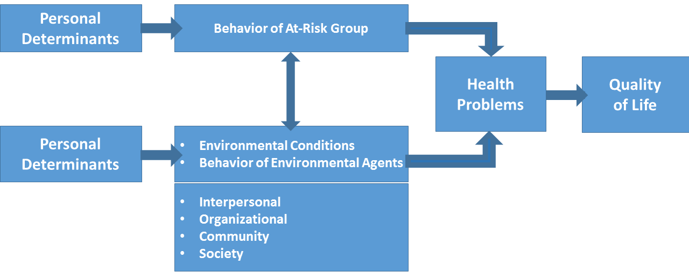

# Step 1

**Step 1 - Background**: Intervention Mapping guides health promotion planners through the process of program design by means of a series of steps and tasks. It also provides tools and aids to structure and monitor the work during the process: matrices, tables, lists and working documents. 

Step 1 should lead to answers to a series of questions helping in reaching a **logic model of the problem**: 

_**What is the problem, why is it a problem at all, since when it is a problem and for whom it is a problem, what causes the problem, who needs to be convinced this problem should be solved, who must help solve the problem, and, yes, the problem contains social psychological aspects and should potentially be solvable.**_

To answer these questions, IM begins with an analysis of community needs and capabilities. This analysis addresses people’s quality of life, health concerns and relevant behavioral and environmental conditions, as well as the community capacities that are potentially useful in improving community health. 

To first come to a solid problem definition, IM starts with a _planning group_ to gather data from multiple sources about the problem and its background. This is to better understand all the facets of the problem, and to estimate the feasibility of possible interventions. Usually this will be a combination of a work group and various advisory groups, consisting of members of the community, including those with the problem, mostly your target group (or their parents for instance when you want to target behavior in children) and individuals with the relevant expertise. Here, your little group is the planning group, but we also want you to think of who would need to be in the planning group. 

Given the nature of this Master, always keep the developmental phase of target group in mind; an intervention can be different for individuals of –for instance- different ethnicity, gender, SES, but also for children, adolescents, adolescents with a mild intellectual disability, students, professionals, or the elderly. 

## Task: Conduct a needs assessment to create a logic model of the problem

   * Brainstorm about the topic: what do you all already know about the problem?   
   * Use some efficient internet searches to get an idea of all aspects of the chosen problem 

When we say 'brainstorm', we mean that you have to try to address all aspects of the problem. Usually, you ask 'what-where-why-who-for whom' questions to get to the bottom of the problem. We help you out for your first 'brainstorm' with the following questions you can ask yourselves to get started.

* What is the central problem?   
* Why is it a problem? Is it a serious problem?  
* In what sense is it related to health? Who’s health?  
* For whom is it a problem (target groups; stakeholders)?   
* Which age-group (or more specific group) do you target?  
* What behaviors are related to the problem, or cause the problem?   
* What are the environmental conditions or conditions that are related to the problem?
* Who are the environmental agents who can control the environmental conditions, and what do they need to do to change those conditions?
* What are the determinants or correlates of the behaviors involved, both for the target population, and for the environmental agents?
* Whose cooperation is necessary to help solve the problem? 
* Describe the context: How does the environment directly or indirectly contribute to the problem?  
* What are the behaviors of the at-risk group?
* What environmental conditions contribute to the problem (at the interpersonal, organizational, communal and societal level)?
* What would be the best intervention setting?  
* Identify the problem and the target group (e.g. who is at risk) (see Logic model of a problem below)

### Examples

1. We want to promote social distancing in Amsterdam and we want to target the older population
  1. Behavior at risk group = They do not always keep the proper distance when in the streets 
  2. Target group = 60+ years old citizen
  3. Environmental conditions = the sidewalks are not wide enough
  4. Environmental agents = the municipality
  5....

## Task: Planning group

* Who would you ask for your planning group?  
 
 

 
* Who represents your target population? (e.g. members of the at-risk group are important participants in a planning group)
* Who are possible environmental agents (e.g. decision makers)?
* Who are the potential program implementers (e.g. the professionals who are going to implement your program)?
* Produce the logic model of the problem

## Task: Stating program goals 

* Brainstorm the key determinants of the behavioral and environmental conditions (WHY does the at-risk group behave this way? WHY do the environmental agents maintain or exacerbate unhealthy conditions?) 

  * Make a list of at least 4 key (personal) determinants of behavior  
  * Make a list of at least 4 key (personal) determinants of environmental condition & agent  
  * Show your logic model of the problem in a figure     

* Determine your program goals  
  
  * Prioritize on the basis of the needs assessment (see p. 254)  
  * Decide what behaviors or environmental conditions are most relevant and most likely to change  
  * State in one sentence the expected change of your intervention and its time frame in clear quantifiable terms.  

List the program goals.

