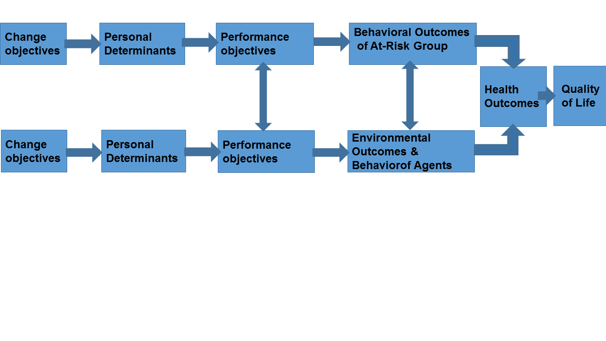

# Tuesday

| Time   | Content             | Teaching form    | Teacher            |                 
| ------ | ------------------- | ---------------- | ------------------ |
| 9-11h  | **Step 2 Logic model of change** | Plenary session | Prof Dr Rob Ruiter |
| 11-13h | **Performance objectives** | Little groups |
| 13-15h | **Feedback on your progress** | Plenary session | Prof Dr Rob Ruiter |
| 15-17h | **Determinants** | Little groups |  

-----

**Background Step 2**: IM change objectives have to be specified explaining _who and what will change as a result of the intervention_. 

Change objectives may refer to 

  * the _individual level of change_, e.g.,"adolescents will express confidence regarding negotiating condom use with a sexual partner"  
  * the _organizational level change_, e.g., "school administrators will acknowledge the advantages of condom distribution in school'  
  * or the _community level change_, e.g., "community leaders will approve of the sale of inexpensive condoms in schools and meeting places". 

Change Objectives should be  
    
  * **_Specific_**: Define as specific as possible: e.g., what should change in the target group and/or the environment in order to deal with or reduce the health-related problem. What should change, among whom?  
 * **_Measurable_**: Can you measure the change (objectives)?  
* **_Achievable_**: Are the change objectives you set achievable and attainable?  
* **_Realistic_**: Can you realistically achieve the objectives with the resources you have?  
* **_Time_**: Within what period will you achieve your change goals?

Figure: Logic Model of Change (Bartholomew et al., 2016, p. 285)

## Task: Individual health-related behavior and environmental outcomes 

**What are the desired changes in behavior and the environment?**

  * Make a list of at least 4 key health promoting behavioral outcomes of the target group     
  * Make a list of environmental conditions that need to be achieved (both key health promoting environmental outcomes and behavior outcomes of agents)   

To identify the performance objectives for health promoting behaviors, ask yourself the following question:  
“What do the people have to do to perform the health-related behavior?”
For example, when you like to promote condom use (health promoting behavior), you want people to plan condom use; therefore one has to obtain condoms in order to use them. 

To find out the performance objectives for environmental conditions, ask yourself the following question: 
”What does the environmental agent need to do to accomplish the changes in environmental conditions?”
For example, you want to make it easy for people to acquire condoms. Therefore, they should be easily available.

## Task - Performance objectives for the behavioral and environmental outcomes 

**Specify the required actions (performance objectives) for the health promoting behavioral outcomes and environmental outcomes** 	

>Formulate performance objectives in a way that makes them measurable and that describes action. A major mistake is to formulate performance objectives as determinants: “X should be able to do Y”. That is not a performance objective; a performance objective should be: “X does Y”.

     *List the most important behavioral outcomes (a maximum of four performance objectives for each individual health-related behavior in total, at least one of each).  
     * List the most important environmental outcomes (a maximum of four  performance objectives per environmental outcome: specifying agents at all levels: the interpersonal level, the organizational level, and the community / societal level).

## Task- Specify the determinants of your performance objectives 

Personal determinants are under the person’s control. 
Environmental ‘determinants’ are not directly under the person’s control but under control of the agent – treat those under environmental conditions.

●	**Brainstorm determinants**. Try to apply behavioral theories (see chapter 2 of the book) and use the determinants of the behavioral or environmental outcomes addressed in the needs assessment.  
 + List personal determinants for each performance objective from task 2.2 from the performance objectives for each individual health-related behavior.  
 + List personal determinants for each performance objective from task 2.2, from the performance objectives for and the environmental condition or agents’ performance objectives.  
 + Read ‘Rating importance of determinants’, IM Book, pp. 306-308.  
 + Select from your list those determinants for your intervention that are important - they contribute significantly to the behavior (0, +, or ++), and that are changeable - they can be changed with the available methods (0, +, or ++). Consult the literature and your common sense to make these decisions.   
 + Copy the table below into your slides and identify the determinants that you want to focus on.   
 + Clearly indicate the ones you want to focus on.

**Determinants of health promoting behavior**

| Determinants | Importance | Changeability |
| --- | --- | --- | 
| .................................. | .................................. | .................................. | 
| .................................. | .................................. | .................................. |
| .................................. | .................................. | .................................. |

Etc

**Determinants of environmental conditions/agents**

| Determinants | Importance | Changeability |
| --- | --- | --- | 
| .................................. | .................................. | .................................. | 
| .................................. | .................................. | .................................. |
| .................................. | .................................. | .................................. |

## Task - Specify the desired change objectives

●	Build matrices (on pptx slides) 

First, read the following:
Change objectives are the specific goals of your intervention. Change objectives literally state what should change at the individual levels, or what should change among environmental agents. Change objectives can be formulated when you cross performance objectives with their determinants. Therefore, you have to build matrices. You have to create one matrix for every health promoting behavior, every target group, and every environmental agent, that has to be influenced. For each matrix, put your performance objectives down the left-hand column. Put your personal determinants across the top. Fill in the cells with change objectives. 

For change objective at the individual level ask: “What do people need to learn with regard to the determinant to do the performance objective?” 
For example, for a change objective regarding self-efficacy, you might ask: _“What do people need to learn in regard to self-efficacy to carry a condom?”_
For environmental level change objectives you might ask: _“What do agents need to learn with regard to the determinant in order to do the performance objective?”_ 
For a change objective regarding social norms in the community you might thus ask: _“What do people in the community need to learn in order for the person to carry condoms?”_ 

Formulate change objectives in a way that makes them **measurable** by using active verbs such as “shows”, “indicates”, “demonstrates” etc; see examples of active verbs on page 317 of the IM book.
 
