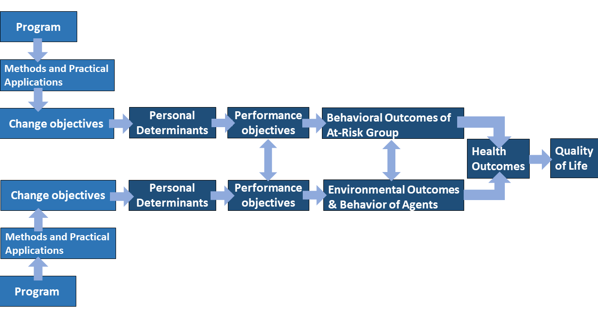

# Step 3

In step 2, you produced a matrix of change objectives and you started on the Acyclic Behavior Change Diagram (ABCD; the logic model of change). In step 3, you will complete this ABCD by filling the three left-most columns. You will also wrap all this together into one coherent intervention by producing a program theme, designating each application to one or more program components, and deciding on the compenents' sequence and the program scope.

In the 4th edition of the Intervention Mapping textbook, step 3 is discussed in Chapter 6, where the following learning objectives and tasks are discussed:

- Generate program themes, components, scope, and sequence
- Choose theory- and evidence-based change methods
- Select or design practical applications to deliver change methods

Pages 345-364 of the fourth edition of the IM book cover these tasks and give some examples. In this chapter of the workbook, we will do the work in these tasks. However, in these exercises, we deviate a bit from the structure in the book to easily split each task into subtasks.

In the online version of this workbook, we used boxes with different colours to clearly signal types of content:

- Green box: Brainstorm
- Blue/purple box: Examples 
- Red box: Product that should be done in the main google doc/google sheet/presentation. 

In the downloadable version of this workbook, these boxes do not yet have a colour. On that note: if you happen to be good with LaTeX and willing to help out, it would be great of you could get in touch.

<!----------------------------------------------------------------------------->
<!----------------------------------------------------------------------------->
<!----------------------------------------------------------------------------->

## Select methods and applications

The change objectives in each of your Matrix of Change Objectives, which correspond to the sub-determinants in column D of your ABCD matrix, exhaustively describe what you will target (and therefore, can expect to change) for each targeted population (e.g. your target population, each environmental agent, etc).

Each of these sub-determinants represent psychological constructs that describe parts of the human psychology. As such, each relates to specific other constructs, such as psychological variables and processes. Ultimately, these constructs are metaphors for regularities in the neural networks that together form the human brain. All changes in those neural networks are called learning, and changing these constructs, therefore, inevitably also requires learning.

In humans (and other organisms), nine learning processes evolved, called Evolutionary Learning Processes [ELPs; @crutzen_evolutionary_2017]. These learning processes each correspond to specific parts of the human brain: some have to do with social processes, some are more about habits. When developing behavior change interventions, however, you normally don't use ELPs: instead, you use Behavior Change Principles (BCPs) that leverage these very low-level ELPs in higher level descriptions. This has two important implications. First, each BCP works best to target specific psychological constructs. Second, when applying a BCP, it is important to closely approximate the conditions under which the underlying ELPs are effective. These conditions are described in each BCPs conditions for effectiveness.

In Intervention Mapping, BCPs are called "methods", and each method's conditions for effectiveness are called "parameters for effectiveness". They are listed in Tables 6.5 to 6.18 in Chapter 6 (pages 345-433 of the 4th edition of the book), as well as included in the supplementary materials available at https://osf.io/ng3xh.

In this step, you will add the methods and applications to your ABCD matrix, completing your logic model of change, and you will decide on a theme, a scope, components, and a sequence for your intervention.

## Select methods and applications

Column D of your ABCD matrix contains the complete list of aspects of the psychology of the relevant target group (e.g. your intervention's target population, or an environmental agent, or an implementer, see Step 5). Each aspect (i.e. each sub-determinant / Change Objective) must be targeted by at least one application in your final intervention.

Therefore, start by thinking about which methods and application you want to use. This depends on what you will have available in your intervention: if the intervention can contain interactive elements, other methods are available than if you have to work through letters or bill boards (but letters or bill boards are cheaper, and can be more accessible, than other channels).

Deciding on your methods and applications is an iterative process, and you can approach it from either direction: either start thinking from which theoretical methods you want to use, and then think about how to apply them; or start thinking about how your intervention can look (the application) and then decide which methods are suited for those applications.

The important thing is that for every Change Objective in column D of your ABCD matrix, you specify which method you will use to target it in column A; how you will apply that method in column C; and how, in that application, you will implement that method's parameters for effectiveness in column B.

If you target a Change Objective with multiple applications and/or methods, copy its row, such that you and up with an ABCD matrix where every row lists exactly one structural-causal chain.

Use the determinants in column E to select the methods (the tables referred to above are organised per determinants).

- Study Tables 6.5 to 6.18 in Chapter 6 (pages 345-433 of the 4th edition of the book) or the tables in the supplementary materials available at https://osf.io/ng3xh.
- Select theoretical methods for your Change Objectives. If you are unable to identify methods but able to identify applications, ask yourself – why would it work? The answer will lead you to a method.
- Complete columns A, B, and C of your ABCD matrix.
- Do this both for the ABCD matrix of the target group and for one environmental agent. Note that for environmental agents, different methods exist depending on their environmental level.

- Maybe just link to some full ABCDs?

- Produce a full ABCD matrix and the corresponding diagram.

## Themes, components, scope and sequence

The Acyclic Behavior Change Diagram you now produce is the blueprint for your intervention. However, it is also extremely modular and very far from a coherent whole. Therefore, it is important to tie everything together into a coherent intervention.

To achieve this, you need to organize the applications (column C from your ABCD matrix) into components. Of these components, you need to decide the order in which they will be presented (the sequence), and you will need to decide the scope of each component (e.g. are there topics that should not be addressed?).

You also need a theme. You can think of the theme as the 'face' or 'corporate identity' of your intervention. It is how your intervention will be called and presented to your target group and to implementers.

- Generate ideas about themes, components, scope and sequence of the program
(see page 355 in the book)

-  This is really the moment to be creative together! Of course you could find themes on the internet of well-known interventions, which  might inspire you, or might be crippling and turn you into a copy-cat. 

- Complete the table in the "Themes, components, scope and sequence" section in the google document.

<!-- Replace this image with a better version -->

