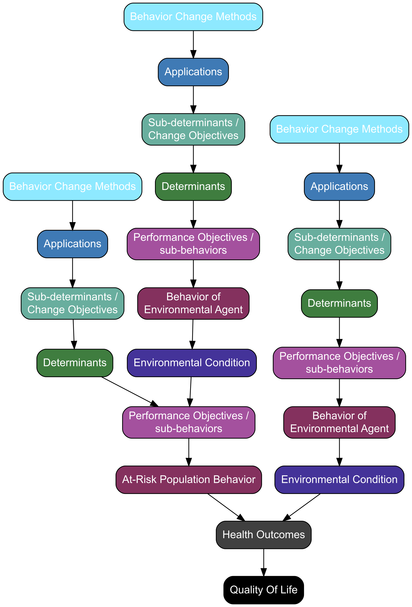

# Step 3

You produced a matrix of change objectives and you started on the Acyclic Behavior Change Diagram (ABCD; the logic model of change) in the previous step. In step 3, you complete this ABCD by filling in the three leftmost columns. You will then wrap all this together into one coherent intervention by producing a program theme, designating each application to one or more program components, and deciding on the components' sequence and the program scope.

In the 4th edition of the Intervention Mapping textbook, step 3 is discussed in Chapter 6, where the following learning objectives and tasks are discussed:

- Generate program themes, components, scope, and sequence
- Choose theory- and evidence-based change methods
- Select or design practical applications to deliver change methods

Pages 345-364 of the fourth edition of the IM book cover these tasks and give some examples. In this workbook, we still do the same work. However, the following exercises deviate from the structure in the textbook, as it is easier to split up each task into subtasks.

<!----------------------------------------------------------------------------->
<!----------------------------------------------------------------------------->
<!----------------------------------------------------------------------------->

<!-- ## Background information -->

<!-- The change objectives in each of your Matrices of Change Objectives correspond to the sub-determinants in column D of your ABCD matrix. They describe what you will target (and thus what you expect to change) for each targeted population (i.e., your target group, your environmental agent(s), etc). -->

<!-- These sub-determinants represent psychological constructs that describe parts of the human psychology. As such, each relates to specific other constructs, such as psychological variables and processes. Ultimately, these constructs are metaphors for regularities in the neural networks that together form the human brain. All changes in those neural networks are called learning, and changing these constructs, therefore, inevitably also requires learning. -->

<!-- In humans (and other organisms), nine learning processes evolved, called Evolutionary Learning Processes [ELPs; @crutzen_evolutionary_2018]. These learning processes correspond to specific parts of the human brain: some have to do with social processes, some are more about habits. When developing behavior change interventions, however, you normally don't use ELPs: instead, you use Behavior Change Principles (BCPs) that leverage these very low-level ELPs in higher level descriptions. This has two important implications: First, each BCP works best to target specific psychological constructs. Second, when applying a BCP, it is important to closely approximate the conditions under which the underlying ELPs are effective. These conditions are described in each BCPs conditions for effectiveness. -->

<!-- In Intervention Mapping, BCPs are called "methods", and each method's conditions for effectiveness are called "parameters for effectiveness". They are listed in Tables 6.5 to 6.18 in Chapter 6 (pages 345-433 of the 4th edition of the book), as well as included in the supplementary materials available at https://osf.io/ng3xh. -->

<!-- In this step, you will add the methods and applications to your ABCD matrix, completing your logic model of change, and you have to decide on a theme, a scope, components, and a sequence for your intervention. -->

## Select methods and applications

Column D of your ABCD matrix contains the complete list of aspects of the psychology of the relevant target group (e.g. your intervention's target group, or an environmental agent, or an implementer, see Step 5). Each  sub-determinant/Change Objective must be targeted by at least one application in your final intervention.

Therefore, it is best to start by thinking about which methods and applications you want to use. This depends on what is available in your intervention: if the intervention contains interactive elements, other methods are available than if you have to work with mailings or bill boards (letters/mailings or bill boards are cheaper, and can be more accessible, than other channels).

Deciding on your methods and applications is an iterative process, and you can approach it from both directions: either you start thinking from which theoretical methods you want to use, and then think about how to apply them; or you can start thinking about what your intervention will look like (the application) and then decide which methods are suited for those applications.

The important thing is that for every Change Objective in column D of your ABCD matrix, you specify which method you will use to target it in column A; how you will apply that method in column C; and how, in that application, you will implement that method's parameters for effectiveness in column B.

If you target a Change Objective with multiple applications and/or methods, copy its row, in such manner that you end up with an ABCD matrix where every row lists exactly one structural-causal chain.

Use the determinants in column E to select the methods (the tables referred to above are organised per determinants).

<div class="coreProcesses">

- Study Tables 6.5 to 6.18 in Chapter 6 (pages 345-433 of the 4th edition of the IM book) or the tables in the supplementary materials available at https://osf.io/ng3xh.
- Select theoretical methods for your Change Objectives. If you are unable to identify methods but able to identify applications, ask yourself – why would it work? The answer will lead you to a method.
- Complete columns A, B, and C of your ABCD matrix.
- Do this both for the ABCD matrix of the target group and for one environmental agent. Note that for environmental agents, different methods exist depending on their environmental level.

</div>


<div class="exampleList">

As you will see in the 2 examples, every ABCD matrix looks different. So, do not immediately think you did something wrong if it is not entirely similar to the examples.

- A list of student-produced ABCD matrices for different behaviors is available at https://im-wb.com/abcd-examples
- A simple ABCD matrix for refraining from using a high dose of MDMA is available [here](https://docs.google.com/spreadsheets/d/1iZpCcUDtqVfHvoSmWv5nDeRqLBX31K4iSFN4dJFOtqw)

</div>


<div class="produceSomething">

- Produce a full ABCD matrix and the corresponding diagram.

</div>


## Themes, components, scope and sequence

The Acyclic Behavior Change Diagram you produced is the blueprint for your intervention. However, it still is far from a coherent whole. It should still be tied together into a coherent intervention.

To achieve this, you need to *organize the applications* (column C from your ABCD matrix) into components. Next, you decide on *the sequence*; the order in which the components will be presented, and decide on *the scope* of each component (e.g., are there topics that should not be addressed?).

You also need a theme. You can think of the theme as the 'face' or 'corporate identity' of your intervention. How do you "call" your intervention and present it to your target group and to implementers?

<div class="coreProcesses">

- Generate ideas about possible themes, components, the scope and sequence of the program
(see page 355 in the book)

</div>

<div class="exampleList">

- This is really the moment to be creative together! Of course you could find themes on the internet of well-known interventions, which  might inspire you, but first seeing other examples might be creativity-crippling and turn you into a copy-cat. We therefore will not give you any examples. 

</div>

<div class="produceSomething">

- Complete the table in the "Themes, components, scope and sequence" section in the google document.

</div>


```{r logic-model-of-change, fig.caption = "A Logic Model of Change with two environmental conditions", echo=FALSE, out.width="50%"}

### scales::show_col(viridis::viridis(end=.8, 6))
col_qol <- "#000000";
col_hlt <- "#000000";
col_env <- "#444444";
col_beh <- "#440154";
col_pob <- "#453882";
col_det <- "#32658E";
col_sdt <- "#228B8D";
col_app <- "#2CB17E";
col_bcp <- "#7AD151";
col_font <- "#FFFFFF";

### Create logic model of behavior
logicModelOfChange <-
  data.tree::Node$new("Quality Of Life");
data.tree::SetNodeStyle(logicModelOfChange, 
                        fontcolor = col_font, fillcolor = col_qol);

tmpNode_healthOutcomes <-
  logicModelOfChange$AddChild("Health Outcomes");
data.tree::SetNodeStyle(tmpNode_healthOutcomes, 
                        fontcolor = col_font, fillcolor = col_hlt);

### Target behavior
logicModelOfChange_targetBehavior <-
  tmpNode_healthOutcomes$AddChild("At-Risk Population Behavior");
data.tree::SetNodeStyle(logicModelOfChange_targetBehavior, 
                        fontcolor = col_font, fillcolor = col_beh);

tmpNode_performanceObjective <-
  logicModelOfChange_targetBehavior$
    AddChild("Performance Objectives /\nsub-behaviors");
data.tree::SetNodeStyle(tmpNode_performanceObjective, 
                        fontcolor = col_font, fillcolor = col_pob);

tmpNode <-
  tmpNode_performanceObjective$AddChild("Determinants");
data.tree::SetNodeStyle(tmpNode, 
                        fontcolor = col_font, fillcolor = col_det);

tmpNode <-
  tmpNode$AddChild("Sub-determinants /\nChange Objectives");
data.tree::SetNodeStyle(tmpNode, 
                        fontcolor = col_font, fillcolor = col_sdt);

tmpNode <-
  tmpNode$AddChild("Applications");
data.tree::SetNodeStyle(tmpNode, 
                        fontcolor = col_font, fillcolor = col_app);

tmpNode <-
  tmpNode$AddChild("Behavior Change Methods");
data.tree::SetNodeStyle(tmpNode, 
                        fontcolor = col_font, fillcolor = col_bcp);

### Environment on behavior
tmpNode_environment <-
  tmpNode_healthOutcomes$AddChild("Environmental Condition");
data.tree::SetNodeStyle(tmpNode_environment, 
                        fontcolor = col_font, fillcolor = col_env);

tmpNode <-
  tmpNode_environment$AddChild("Behavior of\nEnvironmental Agent");
data.tree::SetNodeStyle(tmpNode, 
                        fontcolor = col_font, fillcolor = col_beh);

tmpNode <-
  tmpNode$AddChild("Performance Objectives /\nsub-behaviors");
data.tree::SetNodeStyle(tmpNode, 
                        fontcolor = col_font, fillcolor = col_pob);

tmpNode <-
  tmpNode$AddChild("Determinants");
data.tree::SetNodeStyle(tmpNode, 
                        fontcolor = col_font, fillcolor = col_det);

tmpNode <-
  tmpNode$AddChild("Sub-determinants /\nChange Objectives");
data.tree::SetNodeStyle(tmpNode, 
                        fontcolor = col_font, fillcolor = col_sdt);

tmpNode <-
  tmpNode$AddChild("Applications");
data.tree::SetNodeStyle(tmpNode, 
                        fontcolor = col_font, fillcolor = col_app);

tmpNode <-
  tmpNode$AddChild("Behavior Change Methods");
data.tree::SetNodeStyle(tmpNode, 
                        fontcolor = col_font, fillcolor = col_bcp);

### Environment on performance objective
tmpNode_PO_environment <-
  tmpNode_performanceObjective$AddChild("Environmental Condition");
data.tree::SetNodeStyle(tmpNode_PO_environment, 
                        fontcolor = col_font, fillcolor = col_env);

tmpNode <-
  tmpNode_PO_environment$AddChild("Behavior of\nEnvironmental Agent");
data.tree::SetNodeStyle(tmpNode, 
                        fontcolor = col_font, fillcolor = col_beh);

tmpNode <-
  tmpNode$AddChild("Performance Objectives /\nsub-behaviors");
data.tree::SetNodeStyle(tmpNode, 
                        fontcolor = col_font, fillcolor = col_pob);

tmpNode <-
  tmpNode$AddChild("Determinants");
data.tree::SetNodeStyle(tmpNode, 
                        fontcolor = col_font, fillcolor = col_det);

tmpNode <-
  tmpNode$AddChild("Sub-determinants /\nChange Objectives");
data.tree::SetNodeStyle(tmpNode, 
                        fontcolor = col_font, fillcolor = col_sdt);

tmpNode <-
  tmpNode$AddChild("Applications");
data.tree::SetNodeStyle(tmpNode, 
                        fontcolor = col_font, fillcolor = col_app);

tmpNode <-
  tmpNode$AddChild("Behavior Change Methods");
data.tree::SetNodeStyle(tmpNode, 
                        fontcolor = col_font, fillcolor = col_bcp);

apply_graph_theme <- function (graph, ...) 
{
    for (currentSetting in list(...)) {
        if ((length(currentSetting) != 3) && is.character(currentSetting)) {
            stop("Only provide character vectors of length 3 in the dots (...) argument!")
        }
        else {
            graph <- DiagrammeR::add_global_graph_attrs(graph, 
                currentSetting[1], currentSetting[2], currentSetting[3])
        }
    }
    return(graph)
}

logicModelOfChange_graph <-
  data.tree::ToDiagrammeRGraph(logicModelOfChange);
logicModelOfChange_graph <-
  apply_graph_theme(
    logicModelOfChange_graph,
    c("layout", "dot", "graph"),
    c("rankdir", "BT", "graph"),
    c("outputorder", "nodesfirst", "graph"),
    c("shape", "box", "node"),
    c("fontname", "arial", "node"),
    c("style", "rounded,filled", "node"),
    c("dir", "back", "edge"));

### Not displaying for now because of the problem explained at
### https://stackoverflow.com/questions/62856190/error-with-r-version-4-0-2-but-not-in-r-version-3-6-3-with-diagrammr-latex-er

#DiagrammeR::render_graph(logicModelOfChange_graph);

DiagrammeR::export_graph(
  logicModelOfChange_graph,
  file_name = "img/150---logic-model-of-change.png",
  width = 1800
)


```




<!-- Replace this image with a better version -->

<!--  -->

